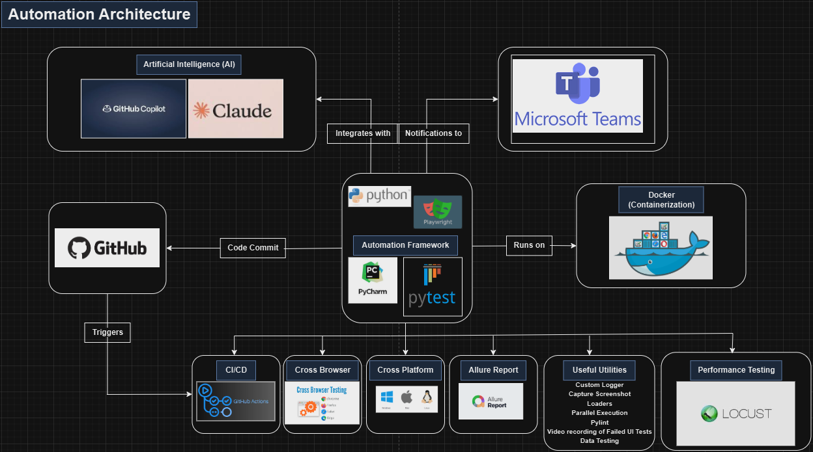
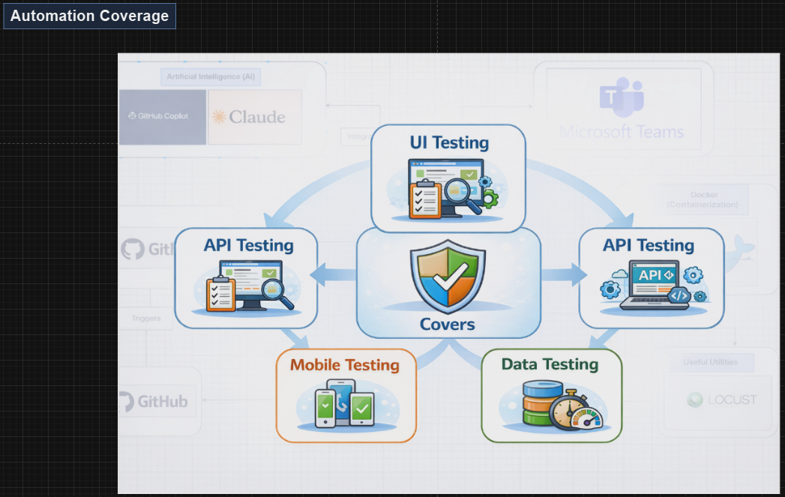

# 🧪 Playwright-Python-Automation-Framework

A scalable and maintainable test automation framework built with Python, leveraging Playwright, Pytest, Pytest-BDD and Appium-Python-Client.
It supports both UI, API and Mobile test automation, with environment-driven configuration for flexibility.
The framework is fully integrated with Docker for containerized execution, GitHub Actions for CI/CD pipelines, and Microsoft Teams for real-time execution notifications.




---
## Features

| # | Feature                                                        | Status        |
|---|----------------------------------------------------------------|---------------|
| 1 | 🎭 Playwright-Python-Pytest Test Automation framework          | ✅ Done        |
| 2 | 🔧 Python programming support                                  | ✅ Done        |
| 3 | 🌐 Cross-browser UI Automation testing (Chrome, Firefox, Edge) | ✅ Done        |
| 4 | 🧪 API testing support with Requests library                   | ✅ In-Progress |
| 5 | 📊 HTML and Allure test reports                                | ✅ Done        |
| 6 | 🎯 Auto-wait, parallel execution and retry mechanisms          | ✅ Done        |
| 7 | 🔧 CI/CD integration with Jenkins and GitHub Actions           | ✅ Done        |
| 8 | 📥 Docker containerization                                     | ✅ Done        |
| 9 | 📢 Microsoft Teams notifications                               | ✅ In-Progress        |
| 10 | 🧩 BDD support with Pytest-BDD                                | ✅ In-Progress        |
| 11 | 📂 Data-driven testing with JSON and Excel                    | ✅ Done        |
| 12 | 🗂️ Page Object Model (POM) design pattern                     | ✅ Done        |
| 13 | 🧑‍💻 Custom logging and screenshot capture on failures        | ✅ Done        |
| 14 | ⚙️ Environment-driven configuration management                 | ✅ Done        |
| 15 | 🎥 Screen capture and video recording of failed UI tests       | ✅ Done        |
| 16 | 📱 Mobile testing support with Appium                          | ✅ In-Progress        |
| 17 | 🦗 Performance testing integration with Locust                 | ✅ In-Progress        |
| 18 | 🗄️ Data testing with REST Countries API                       | ✅ In-Progress        |

---
## ⚡ Quick Setup

1. **Clone the repository:**
   ```bash
   git clone https://github.com/vishruth143/Playwright-Python-Automation-Framework.git
   cd Playwright-Python-Automation-Framework
   ```
2. **Install Python dependencies:**
   ```bash
   pip install -r requirements.txt
   ```
3. **Set environment variables:**
   ```bash
   # Example for UI and API test     
   $env:REGION="QA"
   $env:BROWSER="CHROME"
   $env:HEADLESS="N"
   ```
4. **Run tests:**
   ```bash
    pytest -vvv -m "pta" -n 4 --reruns 3 --html=output/reports/pta_report.html --alluredir=output/allure-results --self-contained-html --capture=tee-sys --durations=10 tests
   ```
5. **Generate Allure report:**
   ```bash
   allure generate output/allure-results --clean -o output/allure-report
   ```
6. **View HTML/Allure report:**
   - Open `output/reports/pta_report.html` in browser
   - Or serve Allure report:
     ```bash
     python -m http.server 8000
     # Visit http://localhost:8000/output/allure-report
     ```
---
## 🚀 Project Folder Structure
```
Playwright-Python-Automation-Framework/
│
├── config/                                      # Environment & test-data configuration
│   ├── common_config.yml                        # Shared/global config values
│   ├── config_parser.py                         # Centralised config loader (YAML / XLSX)
│   └── ui/
│       ├── heroku/
│       │   ├── ui_test_data_config.yml          # Heroku test-data
│       │   └── ui_test_env_config.yml           # Heroku environment URLs / credentials
│       └── pta/
│           ├── ui_test_data_config.yml          # PTA test-data
│           ├── ui_test_env_config.yml           # PTA environment URLs / credentials
│           └── ui_test_excel_data_config.xlsx   # Excel-based test-data
│
├── framework/                                   # Core reusable framework layer
│   ├── pages/
│   │   └── ui/
│   │       └── base_page.py                     # Playwright BasePage – shared page actions
│   └── utilities/
│       ├── common.py                            # Shared helpers (login / logout wrappers)
│       ├── custom_logger.py                     # Parallel-safe coloured rotating logger
│       ├── loaders.py                           # YAML / JSON / Excel file loaders
│       └── screenshot_utils.py                 # Timestamped screenshot path generator
│
├── tests/                                       # All test suites
│   ├── conftest.py                              # Session-scope: cleans output/, Allure setup
│   └── ui/
│       ├── conftest.py                          # UI-scope: browser/page fixtures & hooks
│       ├── heroku/                              # Heroku app tests
│       │   └── pages/                           # Heroku page objects
│       └── pta/                                 # Practice Test Automation app tests
│           ├── conftest.py                      # PTA testdata fixture
│           ├── test_pta_clean_version.py        # PTA test cases
│           └── pages/
│               ├── home_page.py                 # PTA Home page object
│               └── login_page.py               # PTA Login page object
│
├── output/                                      # Generated at runtime (gitignored)
│   ├── allure-results/                          # Raw Allure result files
│   ├── logs/                                    # test_execution.log (merged from workers)
│   ├── reports/                                 # pytest-html reports
│   ├── screenshots/                             # PNG screenshots on failure only
│   └── videos/                                  # WebM videos + traces on failure only
│
├── .gitignore
├── pytest.ini                                   # Pytest markers & default options
├── README.md
└── requirements.txt                             # Python dependencies
```
---
## 🚀 Environment Variables

### 🔹 UI Testing
| Variable    | Description                                                   | Default Value | Required/Optional |
|-------------|---------------------------------------------------------------|---------------|-------------------|
| `REGION`    | Target region/environment (e.g., `QA`, `DEV`, `STAGE`,`PROD`) | `QA`          | `Optional`        | 
| `BROWSER`   | Browser to run tests on (`CHROME`, `FIREFOX`, `EDGE`)         | `CHROME`      | `Optional`        |
| `HEADLESS`  | Run in headless mode (`Y` or `N`)                             | `N`           | `Optional`        |

### 🔹 API Testing
| Variable       | Description                                                   | Default | Required/Optional |
|----------------|---------------------------------------------------------------|---------|-------------------|
| `REGION`       | Target region/environment (e.g., `QA`, `DEV`, `STAGE`,`PROD`) | `QA`    | `Optional`        |

### 🔹 Mobile Testing
| Variable       | Description                                                   | Default | Required/Optional |
|----------------|---------------------------------------------------------------|---------|-------------------|
| `REGION`       | Target region/environment (e.g., `QA`, `DEV`, `STAGE`,`PROD`) | `QA`    | `Optional`        |

---
### Explanation of Flags
| Variable                | Description                                                            |
|-------------------------|------------------------------------------------------------------------|
| `-v`                    | Verbose output (shows test names and status)                           |
| `-vv`                   | More verbose output (adds captured output, fixture info, etc.)         |
| `-vvv`                  | Most verbose output (adds internal debug logs, detailed fixture steps) |
| `-m <expression>`       | Run tests matching the given marker expression (e.g., `pta or jsonplaceholder`) |
| `--html=...`            | Save HTML report to specified path                                     |
| `--self-contained-html` | Embed CSS/JS into the report (no external files)                       |
| `--capture=tee-sys`     | Shows print() and log output in both terminal & HTML report            |
| `--durations=10`        | Shows top 10 slowest tests (for optimization)                          |
| `--maxfail=1`           | Stop after first failure                                               |
| `--disable-warnings`    | Disable warning output                                                 |
| `--log-cli-level=INFO`  | Set log level for console output (e.g., DEBUG, INFO, WARNING, ERROR)   |
| `-n 4`                  | Run tests in parallel using 4 CPU cores                                |
| `--reruns 3`            | Rerun failed tests up to 3 times                                       |
| `-s`                    | Disable output capturing — prints `print()` statements directly to terminal |
| `tests`                 | Path to your test suite root                                           |

---
## 🖥️ Running PTA UI Tests from Command Line (PowerShell)
```bash
    $env:REGION="QA"
    $env:BROWSER="CHROME"
    $env:HEADLESS="N"
    pytest -vvv -m "pta" -n 4 --maxfail=1 --log-cli-level=INFO --reruns 3 --html=output/reports/report.html --alluredir=output/allure-results --self-contained-html --capture=tee-sys --durations=10 tests
```

## 🖥️ Running Heroku UI Tests from Command Line (PowerShell)
```bash    
    $env:REGION="QA"
    $env:BROWSER="CHROME"
    $env:HEADLESS="N"
    pytest -vvv -m "heroku" --maxfail=1 --log-cli-level=INFO --reruns 3 --html=output/reports/hirokuapp_report.html --alluredir=output/allure-results --self-contained-html --capture=tee-sys --durations=10 tests
```

## 🖥️ Running API Tests from Command Line (PowerShell)
```bash    
    $env:REGION="QA"    
    pytest -vvv -m "jsonplaceholder" -n 4 --maxfail=1 --log-cli-level=INFO --reruns 3 --html=output/reports/report.html --alluredir=output/allure-results --self-contained-html --capture=tee-sys --durations=10 tests
```
## 🖥️ Running Mobile Tests from Command Line (PowerShell)
```bash           
    pytest -vvv -m "kwa" --maxfail=1 --log-cli-level=INFO --reruns 3 --html=output/reports/report.html --alluredir=output/allure-results --self-contained-html --capture=tee-sys --durations=10 tests
```
## 🦗 Running Performance Tests with Locust (PowerShell)
```bash
    # With web UI — open http://localhost:8089 to start/monitor the test
    $env:REGION="QA"
    locust -f tests/performance/locustfile.py

    # Headless (CI/CD)
    $env:REGION="QA"
    locust -f tests/performance/locustfile.py --headless --host=https://jsonplaceholder.typicode.com -u 10 -r 2 --run-time 60s --html=output/reports/performance_report.html
```
## 🗄️ Running Data Quality Tests (PowerShell)
```bash
    $env:REGION="QA"
    pytest -vvv -m "restcountries_data" tests/data/ --html=output/reports/data_report.html --self-contained-html --alluredir=output/allure-results tests
```
---
## 🖥️ To see all the environment variables currently set, you can run:

**PowerShell:**
```powershell
Get-ChildItem Env:
# or shorthand
gci env:
```

**Bash (Git Bash / Linux / macOS):**
```bash
env
# or
printenv
```

**CMD (Command Prompt):**
```cmd
set
```
---
## 🖥️ If you want to filter and see only the ones you set (REGION, BROWSER, HEADLESS etc.), you can do:

**PowerShell:**
```powershell
Get-ChildItem Env: | Where-Object { $_.Name -in @("REGION","BROWSER","HEADLESS") }
```

**Bash (Git Bash / Linux / macOS):**
```bash
env | grep -E "^(REGION|BROWSER|HEADLESS)="
```   
---
## 🐳 To run on docker container: (PowerShell)

    # To build docker image
    docker build -t selenium-python-automation .
    
    # To run on Chrome browser
    docker run -e REGION=qa -e BROWSER=CHROME -e HEADLESS=Y selenium-python-automation pytest -vvv -m "pta or jsonplaceholder" -n 4 --maxfail=1 --log-cli-level=INFO --reruns 3 --html=output/reports/report.html --alluredir=output/allure-results --self-contained-html --capture=tee-sys --durations=10 tests
    
    # To run on Firefox browser
    docker run -e REGION=qa -e BROWSER=FIREFOX -e HEADLESS=Y selenium-python-automation pytest -vvv -m "pta or jsonplaceholder" -n 4 --maxfail=1 --log-cli-level=INFO --reruns 3 --html=output/reports/report.html --alluredir=output/allure-results --self-contained-html --capture=tee-sys --durations=10 tests
    
    # To run on Edge browser
    docker run -e REGION=qa -e BROWSER=EDGE -e HEADLESS=Y selenium-python-automation pytest -vvv -m "pta or jsonplaceholder" -n 4 --maxfail=1 --log-cli-level=INFO --reruns 3 --html=output/reports/report.html --alluredir=output/allure-results --self-contained-html --capture=tee-sys --durations=10 tests

---
## ⚡ One-Click Executor Scripts (Windows)

The `executor/` folder contains Windows batch scripts that run the full test suite **and** generate + serve the Allure report in a single step — no manual commands needed.

### Available Executors

| Script | Test Suite | App / Service | Browser |
|--------|-----------|---------------|---------|
| `executor/heroku_ui_tests_executor.bat` | Heroku UI tests | `-m "heroku"` | Chrome (headless) |
| `executor/pta_ui_tests_executor.bat` | PTA UI tests | `-m "pta"` | Chrome (headless) |
| `executor/jsonplaceholder_api_tests_executor.bat` | JSONPlaceholder API tests | `-m "jsonplaceholder"` | N/A |

### How to Run

**Option A — Double-click:**
Navigate to the `executor/` folder in Windows Explorer and double-click the desired `.bat` file.

**Option B — PowerShell terminal:**
```powershell
# From the project root
cmd /c executor\heroku_ui_tests_executor.bat
cmd /c executor\pta_ui_tests_executor.bat
cmd /c executor\jsonplaceholder_api_tests_executor.bat
```

### What Each Script Does
1. Sets the required environment variables (`REGION`, `BROWSER`, `HEADLESS` where applicable)
2. Runs pytest with `-n 4` parallel workers, Allure results, and HTML report
3. Validates that `output/allure-results/` exists and is not empty (exits with error if not)
4. Generates the Allure report via `allure generate output/allure-results --clean -o output/allure-report`
5. Opens `http://localhost:8000/output/allure-report` in your default browser and starts a local HTTP server

> Press **Ctrl+C** in the terminal to stop the HTTP server when done viewing the report.

### Prerequisites for Executor Scripts
- Python virtual environment must be activated (`.venv\Scripts\activate`)
- Allure CLI must be on your PATH — install via:
  ```powershell
  Set-ExecutionPolicy RemoteSigned -scope CurrentUser
  iwr -useb get.scoop.sh | iex
  scoop install allure
  ```
- Google Chrome must be installed (for UI executor scripts)

---
## 📊 Allure Report

### Step 1 — Install Allure CLI (once)
```powershell
Set-ExecutionPolicy RemoteSigned -scope CurrentUser
iwr -useb get.scoop.sh | iex
scoop install allure
```

### Step 2 — Run Tests and Collect Results
```powershell
pytest --alluredir=output/allure-results tests
```

### Step 3 — Generate the Allure Report
```powershell
allure generate output/allure-results --clean -o output/allure-report
```

### Step 4 — Serve and View the Report
```powershell
python -m http.server 8000
# Visit http://localhost:8000/output/allure-report
```
> Press **Ctrl+C** to stop the server when done.

---

### ⚡ One-Click: Run Tests + Generate + Open Report
Use the executor scripts to do all of the above in a single double-click:
```powershell
# From the project root
cmd /c executor\jsonplaceholder_api_tests_executor.bat
cmd /c executor\pta_ui_tests_executor.bat
cmd /c executor\heroku_ui_tests_executor.bat
```
     The default browser will automatically open `http://localhost:8000/output/allure-report` when the report is ready.
---
## 🖥️ CI / CD Integration with GitHub Actions and Jenkins

---

### 🐙 GitHub Actions

The pipeline triggers automatically when changes are pushed or merged to `main` for any of the following:

**Folders:** `.github/`, `config/`, `framework/`, `tests/`  
**Files:** `Dockerfile`, `pytest.ini`

**Viewing Results:**
1. Go to the **Actions** tab in GitHub → select the latest workflow run
2. Download `allure-report.zip` from the **Artifacts** section
3. Extract the zip, open a terminal in the extracted folder and run:
   ```powershell
   python -m http.server 8000
   # Visit http://localhost:8000
   ```

---

### 🔧 Jenkins

#### Prerequisites
- Jenkins installed and running (default: `http://localhost:8080`)
- Docker installed and accessible to Jenkins
- This repo connected to Jenkins via SCM (Git)

#### One-Time Setup — Create the Pipeline Job
1. Open Jenkins → **New Item**
2. Enter a name (e.g., `Selenium-Python-Automation-Framework`) → select **Pipeline** → click **OK**
3. Under the **Pipeline** section:
   - Set **Definition** to `Pipeline script from SCM`
   - Set **SCM** to `Git`
   - Enter repo URL: `https://github.com/vishruth143/Selenium-Python-Automation-Framework.git`
   - Set **Script Path** to `Jenkinsfile`
4. Click **Save**

#### Running the Pipeline
1. Open the job → click **Build with Parameters**
2. Select **BROWSER**: `CHROME`, `FIREFOX`, or `EDGE`
3. Click **Build**

#### What the Pipeline Does

| Stage | Action |
|-------|--------|
| **Checkout** | Pulls latest code from Git |
| **Build Docker Image** | `docker build -t selenium-python-automation .` |
| **Run Tests** | Runs `pytest -m "pta or reqres"` inside the container with `HEADLESS=Y` |
| **Copy Results** | Copies `output/` (reports, logs, screenshots) from container to Jenkins workspace |
| **Cleanup** | Removes the test container |
| **Post** | Archives `output/reports/report.html` and `output/allure-results/**` as artifacts |

#### Viewing Results
1. Click the build number → **Artifacts** → open `output/reports/report.html`
2. For Allure: download `output/allure-results/`, extract, then run:
   ```powershell
   python -m http.server 8000
   # Visit http://localhost:8000
   ```


## 🖥️ Notification to MS Team
### On MS Teams
```text
1. Create a Team with Channel in MS Team.
2. Click on the ... beside the channel you want the notifications to be sent and select 'Manage channel'.
3. Under 'Connectors' section Click 'Edit'.
4. Search for 'Incoming Webhook' and click 'Add'.
5. Provide the name for the 'Incoming Webhook' and click on 'Create'.
6. Copy the Webhook URL.
```

### On GitHub
```text
1. Go to your workflow and click on the Settings.
2. On the left side panel under 'Secrets and variables' click on 'Actions'.
3. Click on the 'New repository secret'.
4. Provide Name=TEAMS_WEBHOOK_URL Secret="<Webhook URL from the MS Teams>".
5. Click on 'Add secret'.
```

### Screen Recording for failed UI tests
```text
1. Download and Install ffmpeg from: https://ffmpeg.org/download.html
2. For Windows, click on the “Windows” logo and choose a build (e.g., from gyan.dev or BtbN).
3. Download the “release full” zip file.
4. Extract the zip file and add the bin folder to your system PATH i.e. C:\ffmpeg\bin
5. Verify the installation by running `ffmpeg -version` in your command prompt.
```

---
## 📝 Conventional Commit Message Reference

This project follows the [Conventional Commits](https://www.conventionalcommits.org/) specification for all commit messages.

### ✅ Format
```
<type>(<optional scope>): <short summary>

<optional body — explains WHAT and WHY>

<optional footer — e.g. BREAKING CHANGE, closes #issue>
```

### 🏷️ Commit Type Prefixes

| Prefix | When to use | Example |
|--------|-------------|---------|
| `feat` | A new feature is added | `feat(login): add remember-me checkbox` |
| `fix` | A bug fix | `fix(logger): release file handlers before output cleanup` |
| `chore` | Routine tasks, dependency updates, tooling — no production logic change | `chore(deps): bump selenium 4.41.0 → 4.43.0` |
| `docs` | Documentation changes only | `docs(readme): add conventional commits reference` |
| `style` | Code formatting, whitespace, missing semicolons — no logic change | `style: reformat imports in conftest.py` |
| `refactor` | Code restructured without fixing a bug or adding a feature | `refactor(common): extract login steps into helper method` |
| `test` | Adding or updating tests | `test(pta): add test_pta1.py for login flow` |
| `perf` | Performance improvement | `perf(conftest): load config once at session scope` |
| `ci` | Changes to CI/CD pipeline files (GitHub Actions, Jenkinsfile, Dockerfile) | `ci: add headless flag to GitHub Actions workflow` |
| `build` | Changes that affect the build system or external dependencies | `build: upgrade to Python 3.13` |
| `revert` | Reverts a previous commit | `revert: revert "feat(login): add remember-me checkbox"` |

### 🔍 Scope (optional)
The scope is a short noun describing the section of the codebase affected.  
Place it in parentheses after the type: `fix(conftest):`, `feat(login):`, `chore(deps):`

Common scopes used in this project:

| Scope | Refers to |
|-------|-----------|
| `deps` | `requirements.txt` dependency changes |
| `conftest` | `tests/conftest.py` or any `conftest.py` |
| `logger` | `framework/utilities/custom_logger.py` |
| `common` | `framework/utilities/common.py` |
| `config` | `config/` directory |
| `pta` | PTA UI test suite |
| `hirokuapp` | The Internet Herokuapp UI test suite |
| `jsonplaceholder` | JSONPlaceholder API test suite |
| `performance` | `tests/performance/`, `config/performance/` |
| `data` | `tests/data/`, `config/data/` |
| `kwa` | KWA mobile test suite |
| `ci` | `.github/workflows/`, `Jenkinsfile`, `Dockerfile` |
| `readme` | `README.md` |

### ⚠️ Breaking Changes
If a commit introduces a breaking change, add `BREAKING CHANGE:` in the footer or append `!` after the type:
```
feat(config)!: rename region key from 'qa' to 'QA' in env config

BREAKING CHANGE: all config YAML files must now use uppercase region keys.
```

### 💡 Quick Examples Used in This Project

```
feat(pta): add test_pta_clean_version.py with clean login test without tutorial comments

fix(conftest): release log handlers before rmtree to fix Windows file lock

chore(deps): bump pytest 8.4.2 → 9.0.3, selenium 4.41.0 → 4.43.0, faker 40.11.1 → 40.13.0, requests 2.33.0 → 2.33.1

docs(readme): add conventional commits reference section

test(pta): add detailed tutorial comments to test_pta.py for onboarding
```

---
## 🤖 MCP Servers Configuration

This project uses [Model Context Protocol (MCP)](https://modelcontextprotocol.io/) servers to extend GitHub Copilot with additional tools (browser automation, file system access, REST API testing, database queries, Excel, and Word document manipulation).

The configuration file is located at:
```
%LOCALAPPDATA%\github-copilot\intellij\mcp.json
```

### `mcp.json`
```json
{
  "servers": {
    "github": {
      "url": "https://api.githubcopilot.com/mcp/"
    },
    "playwright": {
      "command": "npx",
      "args": [
        "@playwright/mcp@latest"
      ]
    },
    "selenium": {
      "command": "npx",
      "args": [
        "-y",
        "@angiejones/mcp-selenium"
      ]
    },
    "filesystem": {
      "command": "npx",
      "args": [
        "-y",
        "@modelcontextprotocol/server-filesystem",
        "C:\\Users\\<your-username>\\files_claude"
      ]
    },
    "excel": {
      "command": "cmd",
      "args": [
        "/c",
        "npx",
        "--yes",
        "@negokaz/excel-mcp-server"
      ],
      "env": {
        "EXCEL_MCP_PAGING_CELLS_LIMIT": "4000"
      }
    },
    "rest-api": {
      "command": "node",
      "args": [
        "C:\\Users\\<your-username>\\AppData\\Roaming\\npm\\node_modules\\dkmaker-mcp-rest-api\\build\\index.js"
      ],
      "env": {
        "REST_BASE_URL": "https://rahulshettyacademy.com/",
        "HEADER_Accept": "application/json"
      }
    },
    "mysql": {
      "command": "C:\\Python\\3.13.7\\Scripts\\uv.exe",
      "args": [
        "--directory",
        "C:\\Python\\3.13.7\\Lib\\site-packages",
        "run",
        "mysql_mcp_server"
      ],
      "env": {
        "MYSQL_HOST": "localhost",
        "MYSQL_PORT": "3306",
        "MYSQL_USER": "root",
        "MYSQL_PASSWORD": "root",
        "MYSQL_DATABASE": "rahulshettyacademy"
      }
    },
    "word-document-server": {
      "command": "uvx",
      "args": ["--from", "office-word-mcp-server", "word_mcp_server"]
    }
  }
}
```

### MCP Server Reference

| Server | Package | Purpose |
|--------|---------|---------|
| `github` | GitHub Copilot MCP (remote) | GitHub repo, PR, issue, and search management |
| `playwright` | `@playwright/mcp@latest` | Browser automation — navigate, click, screenshot, snapshot |
| `selenium` | `@angiejones/mcp-selenium` | Selenium WebDriver interactions for browser testing |
| `filesystem` | `@modelcontextprotocol/server-filesystem` | Read/write files within allowed local directories |
| `excel` | `@negokaz/excel-mcp-server` | Read, write, and format Excel workbooks |
| `rest-api` | `dkmaker-mcp-rest-api` | Test REST API endpoints (base URL: `https://rahulshettyacademy.com/`) |
| `mysql` | `mysql_mcp_server` (via `uv`) | Execute SQL queries against a local MySQL database |
| `word-document-server` | `office-word-mcp-server` (via `uvx`) | Create and manipulate Word `.docx` documents |

### Prerequisites

```bash
# Node.js (for npx-based servers)
node --version   # v18+ recommended

# Python uv (for mysql_mcp_server and word-document-server)
pip install uv
# or
winget install astral-sh.uv

# Install the REST API MCP server globally
npm install -g dkmaker-mcp-rest-api
```

> **Note:** Replace `<your-username>` in the paths above with your actual Windows username before using the config.

---
## 🤖 Calude-Github integration
Open the Claude Code console and execute the below command

```claude
/install-github-app
```

### Prerequisites
Install GitHub CLI from https://cli.github.com/ 

   - macOS: brew install gh
   - Windows: winget install --id GitHub.cli
   - Linux: See installation instructions at https://github.com/cli/cli#installation
   
---
# 🎭 Happy testing! 🎭